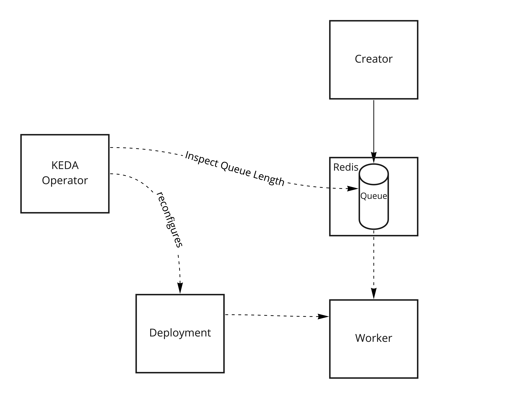

# Keda Redis Demo



This Demo repository shows how to automatically Scale Kubernetes Pods based on the Redis Queue length. The Project can automatically bootstrap the K3d cluster with Flux.

## Cluster Bootstrap

On a high level you need to provide a Github token with the following scopes: `repo_status`, `public_repo`. You can find the management dialog [here](https://github.com/settings/tokens). This token is used by the flux operator to connect to the git repository and roll-out the desired cluster state based on this repository.

#### 1. Create K3d cluster that exposes a http ingress

```sh
k3d cluster create
```

This might take some time.

#### 2. Switch kubectl to K3d context & inspect cluster-info

```shell
kubectl config use-context k3d-k3s-default
kubectl cluster-info
```

#### 3. Install Flux components with flux bootstrap:

 ```sh
   GITHUB_TOKEN=<token> GITHUB_USER=<username> flux bootstrap github \
   --owner=<username-of-the-repo-owner> \
   --repository=keda-demo \
   --private=false \
   --personal=true \
   --branch=main \
   --path=clusters/local
 ```
   
#### 4. Check the progress of the deployment

```shell
kubectl get Kustomization -n flux-system -w
```
